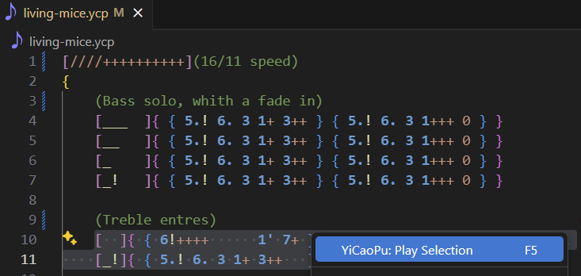

# YiCaoPu

Support for `YiCaoPu`, a simple text-based music score format.

## Features

### Syntax highlighting for `YiCaoPu`.

### Play selection in `YiCaoPu` file.

    In the context menu or press `F5` to play the selection.

### Convert `YiCaoPu` files to `midi` files.

    This will generate a `MIDI` file with the same name.